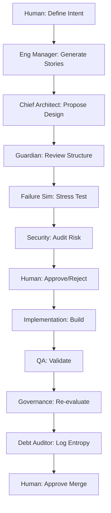

# AI Engineering Organization Operating Protocol (AEOP)

| Metadata         | Value                   |
| ---------------- | ----------------------- |
| **Version**      | 1.0                     |
| **Status**       | Draft                   |
| **Owner**        | Human Product Authority |
| **Last Updated** | 2026-02-16              |

---

## 1. Purpose

This document defines the operating model for an AI-native engineering organization where:

- **The Human** acts as Product Authority and Constraint Designer
- **AI agents** act as a structured, role-based engineering team
- **Governance, safety, and architectural integrity** are enforced through adversarial agent roles
- **Autonomy** is permitted within explicit boundaries

### Protocol Guarantees

This protocol ensures:

- ✓ Architectural coherence
- ✓ Long-term system survivability
- ✓ Traceability
- ✓ Controlled autonomy
- ✓ Reduced entropy accumulation

---

## 2. Core Principles

> **Foundation**: These principles are inviolable and apply to all agents and workflows.

1. **Architecture precedes implementation** - No code without design
2. **Constraints define solution space** - Boundaries enable creativity
3. **All changes must be reviewable** - Transparency is mandatory
4. **No single agent has unchecked authority** - Distributed governance
5. **Adversarial review is mandatory** - Assume failure, prove safety
6. **Structural drift must be detected early** - Entropy compounds exponentially
7. **Non-functional requirements (NFRs) are binding** - Not suggestions
8. **Human authority is final on architectural shifts** - Strategic control remains human

---

## 3. Organizational Roles

### 3.1 Human Roles

#### Product Authority

**Responsibilities:**

- Defines product intent
- Defines constraints (NFRs, cost ceilings, latency budgets)
- Defines security posture
- Approves architectural changes
- Approves risk escalations

**The Human does NOT:**

- ❌ Micro-manage implementation details
- ❌ Write production code unless explicitly necessary

### 3.2 AI Strategic Roles

#### Chief Architect Agent

**Mission:** System design and architectural evolution

- Proposes system architecture
- Drafts ADRs
- Defines module boundaries
- Defines dependency direction
- Proposes architectural evolution

#### Engineering Manager Agent

**Mission:** Product translation and execution planning

- Translates product intent into epics
- Breaks epics into stories
- Defines sequencing
- Identifies cross-cutting concerns
- Flags early risks

### 3.3 AI Execution Roles

#### Implementation Agent

**Mission:** Tactical code delivery within constraints

- ✓ Implements approved stories
- ✓ Generates tests
- ✓ Adds traceability headers
- ✓ Respects architectural boundaries
- ❌ Cannot modify architecture without escalation

#### QA / Test Engineer Agent

**Mission:** Adversarial validation and quality assurance

- Generates test cases
- Identifies edge cases
- Performs adversarial validation
- Tests failure paths
- Tests concurrency assumptions

### 3.4 AI Governance Roles

> **Critical**: These roles enforce system integrity through adversarial analysis.

#### Architecture Guardian

**Mission:** Detect and prevent architectural drift

- Detects architectural drift
- Detects layering violations
- Detects circular dependencies
- Detects abstraction erosion
- Enforces ADR compliance

#### Failure Simulator

**Mission:** Chaos engineering and resilience validation

- Simulates scale (10x, 100x)
- Simulates dependency failures
- Simulates concurrency spikes
- Simulates retry storms
- Evaluates blast radius
- Evaluates observability gaps

#### Security Reviewer

**Mission:** Threat modeling and vulnerability detection

- Identifies injection risks
- Identifies privilege escalation paths
- Evaluates token handling
- Reviews secret management
- Flags insecure dependency usage

#### Tech Debt Auditor

**Mission:** Entropy detection and simplification advocacy

- Detects duplication
- Detects unnecessary abstraction
- Identifies complexity growth
- Suggests simplifications
- Logs TD entries

---

## 4. Authority Boundaries

### 4.1 Architecture Changes

**Only allowed when:**

1. ✓ Proposed by Chief Architect
2. ✓ Reviewed by Architecture Guardian
3. ✓ Stress-tested by Failure Simulator
4. ✓ Approved by Human Product Authority

> ⚠️ **Critical Rule**: If change modifies system invariants → new ADR required.

### 4.2 Implementation Scope

**Implementation Agents may:**

- ✓ Modify code within approved story scope
- ✓ Add tests
- ✓ Improve clarity
- ✓ Refactor locally

**They may NOT:**

- ❌ Introduce new external dependencies without escalation
- ❌ Change dependency direction
- ❌ Alter architectural layering
- ❌ Modify NFR definitions

### 4.3 Escalation Triggers

> 🚨 **Escalation is mandatory when:**

- Architectural invariants change
- New external system is introduced
- Latency budget may be exceeded
- Cost envelope may be exceeded
- Security boundary is altered
- System reliability class changes

**Outcome:** Escalation results in ADR creation.

---

## 5. Workflow Protocol

### 5.1 New Feature Lifecycle



**Steps:**

1. **Human** defines product intent and constraints
2. **Engineering Manager** generates epics and stories
3. **Chief Architect** proposes architecture delta (if needed)
4. **Architecture Guardian** reviews structure
5. **Failure Simulator** stress-tests design
6. **Security Reviewer** audits risk surface
7. **Human** approves or rejects architecture
8. **Implementation Agent** builds story
9. **QA Agent** validates
10. **Governance agents** re-evaluate final state
11. **Tech Debt Auditor** logs entropy
12. **Human** approves merge

### 5.2 Refactor Lifecycle

**Steps:**

1. **Tech Debt Auditor** identifies issue
2. **Chief Architect** proposes safe refactor
3. **Guardian** validates no drift introduced
4. **Failure Simulator** evaluates scale risk
5. **Implementation Agent** executes
6. **Regression tests** required
7. **Human** reviews structural impact

### 5.3 Incident Response Protocol

> 🔥 **If systemic fragility is detected:**

1. **Failure Simulator** identifies blast radius
2. **Security Reviewer** assesses exposure
3. **Guardian** evaluates structural weaknesses
4. **Chief Architect** proposes remediation
5. **Human** approves mitigation plan
6. **Remediation ADR** created
7. **Observability gaps** documented

---

## 6. Traceability Requirements

### Production Code

**All production code must include:**

- ✓ Story reference
- ✓ Architecture reference
- ✓ Domain reference (if applicable)

### Architectural Changes

**All architectural changes must:**

- ✓ Be versioned
- ✓ Be documented as ADR
- ✓ Include rationale
- ✓ Include consequences
- ✓ Include rollback strategy

> ⚠️ **Zero Tolerance**: No silent structural change is allowed.

---

## 7. Autonomy Levels

| Level   | Name         | AI Role                          | Human Role               | Governance               |
| ------- | ------------ | -------------------------------- | ------------------------ | ------------------------ |
| **1**   | Assisted     | Suggests                         | Directs everything       | N/A                      |
| **2**   | Structured   | Implements                       | Governs architecture     | Human reviews all        |
| **3**   | Guarded ⭐   | Design + implement within bounds | Reviews escalations only | Agents enforce structure |
| **4**   | Experimental | Proposes architectural shifts    | Approves diff & risk     | Full agent governance    |

> ⭐ **Default operating mode: Level 3 (Guarded Autonomy)**

---

## 8. Risk Categories

**Each change must be classified:**

| Risk Level   | Definition                              | Examples                        | Approval Required |
| ------------ | --------------------------------------- | ------------------------------- | ----------------- |
| **Low**      | Local modification, no invariant impact | Bug fix, refactor within module | Agent             |
| **Moderate** | Cross-module impact                     | New feature with dependencies   | Agent + Guardian  |
| **High**     | Architectural boundary change           | New service, layer change       | Human             |
| **Critical** | Security or systemic reliability change | Auth system, data migration     | Human             |

> ⚠️ **High and Critical** require mandatory Human approval.

---

## 9. Non-Functional Requirement Enforcement

> **NFRs are binding constraints, not suggestions.**

### Mandatory Evaluation Checklist

Agents must explicitly evaluate:

- [ ] **Latency impact** - Does this meet response time SLAs?
- [ ] **Memory footprint** - Is resource usage within limits?
- [ ] **Throughput ceiling** - Can it handle peak load?
- [ ] **Failure recovery** - What's the recovery time objective (RTO)?
- [ ] **Observability completeness** - Are metrics/logs/traces present?
- [ ] **Security posture** - Are threat models updated?

> 🚫 **Rejection Criterion**: If NFR evaluation is missing → change cannot be approved.

---

## 10. Entropy Control Policy

> **Fundamental Truth**: Entropy increases naturally.

### Continuous Practices

The system must:

- Log technical debt continuously
- Prefer simplification over abstraction
- Avoid premature generalization
- Periodically run architectural health reviews

### Quarterly Health Audit

**Every quarter (or major milestone):**

1. **Full Guardian review** - Architecture drift analysis
2. **Full Failure Simulation review** - Resilience validation
3. **NFR compliance audit** - Performance/security/scale verification

---

## 11. Observability Requirement

**Every new system component must define:**

| Aspect                  | Requirement                    | Purpose                |
| ----------------------- | ------------------------------ | ---------------------- |
| **Logs**                | Structured logs with trace IDs | Debugging and audit    |
| **Metrics**             | RED/USE method coverage        | Performance monitoring |
| **Failure signals**     | Error rates, saturation        | Incident detection     |
| **Alert criteria**      | Thresholds with runbooks       | On-call response       |
| **Recovery indicators** | Health checks, readiness       | Auto-remediation       |

> 🚫 **Prohibition**: Unobservable systems are prohibited.

---

## 12. Model-Agnostic Design

> **Protocol Invariance**: This protocol is model-independent.

### Key Insights

- **LLMs may improve** → Governance requirements do not weaken
- **Better reasoning increases speed** → It does not eliminate architectural entropy

**Why this matters:**

As AI capabilities increase, the need for structural governance increases proportionally. More powerful models can create more complex entropy faster.

---

## 13. Success Criteria

**This AI Engineering Organization is considered healthy when:**

✅ **Architectural drift is minimal** - < 5% deviation from ADRs per quarter

✅ **NFR violations are detected early** - Pre-production, not post-incident

✅ **Refactors reduce complexity** - Cyclomatic complexity trending down

✅ **Incidents have bounded blast radius** - No cascading failures

✅ **New features do not increase systemic fragility** - Resilience metrics stable or improving

✅ **Human cognitive load decreases without loss of control** - Strategic focus, not tactical firefighting

---

## 14. Guiding Philosophy

> **Foundation of this protocol:**

```text
Humans define intent and constraints.
AI explores solution space.
Governance agents enforce structural integrity.
Adversarial simulation prevents fragility.
```

### Core Tension

**Velocity is permitted.**

**Entropy is not.**

---

## Appendix: Quick Reference

### Agent Escalation Matrix

| Scenario             | Primary Agent       | Review Chain                             | Human Approval |
| -------------------- | ------------------- | ---------------------------------------- | -------------- |
| Bug fix              | Implementation      | QA → Debt Auditor                        | No             |
| New feature          | Implementation      | QA → Guardian → Debt Auditor             | Moderate+      |
| Refactor             | Implementation      | Guardian → Failure Sim                   | High+          |
| Architecture change  | Chief Architect     | Guardian → Failure Sim → Security        | Always         |
| Security change      | Security Reviewer   | Failure Sim → Guardian                   | Always         |

### Document References

- **ADRs**: `docs/04-adr/`
- **Stories**: `docs/06-stories/`
- **NFRs**: `docs/03-nfrs.md`
- **Tech Debt**: `docs/07-tech-debt/`
